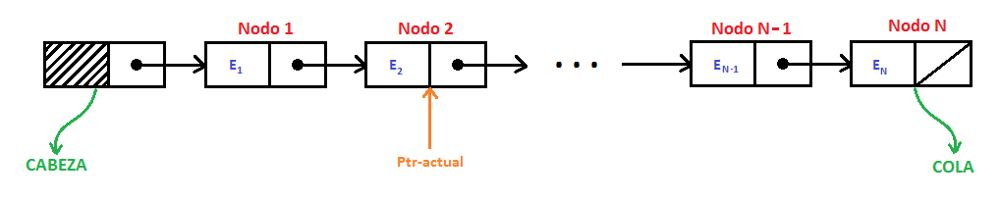

# Estructuras de datos Montículo Binario y Lista Enlazada

Facundo Sonzogni - Trabajo Práctico Nº7 (Montículo Binario y Lista enlazada) - Electrónica IV - 2024

## Introducción

En un lenguaje de programación, se define el ***Tipo de Dato*** de una variable como el conjunto de valores que ésta  puede tomar (Aho, Hopcroft, Ullman); Es, en definitiva, una especie de indicador: Si una variable es de un determinado tipo de dato, significa que dicha variable podrá tomar cualquier valor dentro del conjunto definido por ese tipo de dato.

El lenguaje C acepta cuatro tipos de datos simples:
- **Tipo *int* :** Representa valores enteros de 16 bits.
- **Tipo *float* :** Representa un tipo de dato de punto flotante de 32 bits.
- **Tipo *double* :** Representa un tipo de dato de punto flotante de 64 bits.
- **Tipo *char* :** Representa caracteres de 8 bits.

Estos tipos de datos, pueden emplearse como *Operandos* de diferentes *Operaciones*, cuando se relacionan entre sí a través de un determinado *Operador* definido por el Lenguaje de Programación. Un ejemplo de esto se expone en el Listado 1.

*Listado 1.*
```c
    int A, B, Suma;
    Suma = A + B; 
```

En el ejemplo anterior, "A" y "B" son variables de tipo de dato *int* y son los *operandos*. La *Operación* que se realizó es un Suma, y se realizó al relacionar A y B a través del *Operando* "+".

Una especie de generalización del concepto de tipo de dato se puede realizar a través del concepto de  ***Tipo de Dato Abstracto*** (TDA), definido como "un modelo matemático, junto con una serie de *procedimientos* definidos dentro de ese modelo"(Aho, Hopcroft, Ullman).  
En muchas situaciones, es necesario trabajar con algunas variables que no pueden representarse únicamente mediante tipos *int*, *float*, *double* o *char* de manera eficiente, sino que se requiere definir un nuevo tipo de dato, así como una serie de procedimientos que se pueden realizar con ese tipo de dato; dichos procedimientos constituyen una generalización del concepto de *Operación*. Un ejemplo sencillo de TDA son los conjuntos de números enteros con las operaciones de unión, intersección y diferencia (Aho, Hopcroft, Ullman)

Resulta evidente, entonces, que para poder implementar un algoritmo empleando Tipos de Datos Abstractos en un determinado lenguaje de programación, deberá hallarse alguna manera de representar los TDA en función de los tipos de datos y los operadores manejados por ese lenguaje. Luego, para representar el modelo matemático básico de un TDA, se emplearán ***Estructuras de Datos***, definidas como un "Conjunto de variables (posiblemente de distintos tipos de datos), conectadas entre sí de diversas formas" (Aho, Hopcroft, Ullman).
El componente básico de una estructura de datos es la *Celda*, la cual puede imaginarse como una caja capaz de almacenar un valor tomado de algún tipo de dato básico o compuesto. Finalmente, las estructuras de datos se formarán al dar nombres a agregados de celdas y (opcionalemente) interpretando los valores de algunas celdas como representantes de conexiones entre celdas.(Aho, Hopcroft, Ullman)

Las principales estructuras de datos son: **Pila**, **Cola**, **Lista**, **Árbol** y **Grafo**, y sus posibles derivaciones.

El objetivo de este práctico es familiarizarse con dos tipos de estructuras de datos específicas: 1) El *Montículo Binario*, y 2) La *Lista Enlazada*


## Montículo binario

> Define los conceptos de *arbol binario* y *montículo binario*. Describe
los montículos binarios de máximo y de mínimo. Explica las operaciones básicas
de inserción de un nuevo dato y remoción del máximo o mínimo. Describe la
implementación de un montículo binario utilizando un arreglo.

## Lista enlazada

Antes de comprender el concepto de *Lista Enlazada*, es preciso definir qué es una Lista: Formalemente, podemos definir una **Lista** como un "Arreglo Unidimensional", donde un Arreglo (o *array*) se define como un *Tipo de dato estructurado estático que está conformado por un conjunto finito y ordenado de datos homogéneos*.

A continuación, se desglosa brevemente dicha definición:
- **Tipo de Dato Estructurado:** Decimos que una Lista es un tipo de dato estructurado puesto que todos sus elementos se referencian por la misma variable.
- **Tipo de Dato Estático:** Se trata de un tipo de dato estático, puesto que su tamaño debe estar definido previo a su uso.
- **Datos Homogéneos:** Los elementos de una lista son datos del mismo tipo.
- **Conjunto Ordenado:** Las ubicaciones en memoria de dos elementos consecutivos de una Lista son ubicaciones contiguas.

Tal como se ha explicado, trabajar con un array (Lista) obliga a fijar por adelantado el espacio a ocupar en memoria, de modo que cuando se desea añadir un nuevo elemento que rebase el tamaño prefijado del array, no es posible realizar la operación sin que se produzca un error en tiempo de ejecución. Esta desventaja es una de las principales motivaciones para definir el concepto de ***Lista Enlazada***: "*Una lista enlazada es una colección o secuencia de elementos dispuestos uno detrás de otro, en la que cada elemento se conecta al siguiente elemento por un "enlace" o "puntero"*". (Johanes Aguilar, Zahonero Martinez).

Una lista enlazada es una estructura de datos formada por un número de elementos. Cada elemento de la lista se denomina **NODO** y constituye un tipo de dato estructurado con 2 campos:
- **Primer Campo:** El primer componente de un nodo no es más que el valor que toma la variable que contiene la información que se desea almacenar en dicho elemento de la lista. Es un tipo de dato genérico.
- **Segundo Campo:** El segundo campo de un nodo es un *puntero* que apunta en la dirección del siguiente nodo de la lista.

De esta manera, se consigue que una lista enlazada represente una "Asiganción dinámica de la memoria", pue sno ocupa un tamaño fijo de memoria. Además, los elementos de una lista enlazada no necesariamente se encuentran en ubicaciones contiguas de la memoria que se deba reservar de antemano. A continuación, se muestra una representación gráfica que ilustra el concepto de lista enlazada:


La imagen anterior es una representanción simplificada (y por lo tanto, incompleta) de una Lista enlazada. Para poder hacer una mejor representación, debemos definir dos conceptos muy importantes:

1) La **Cabeza** de la Lista es un nodo que NO tiene ningún elemento (el primer campo es cualquier cosa), que *apunta al primer nodo de la lista*, es decir, el segundo campo guarda la dirección del primer nodo de la lista (NOTA: En el caso de una lista vacía, sin elementos, el puntero de la cabeza es `NULL`).
2) La **Cola** de la lista es el *último nodo de la lista*. El primer campo guardará el valor del último elemenbto de la lista, mientras que el puntero (segundo campo) dependerá del tipo de lista enlazada, las cuáles pueden ser de 4 tipos:

- *Listas simplemente enlazadas* : Cada nodo (elemento) contiene un único enlace que conecta ese nodo al nodo siguiente o nodo sucesor. La lista es eficiente en recorridos directos ("adelante").
- *Listas doblemente enlazadas* : Cada nodo contiene dos enlaces, uno a su nodo predecesor y el otro a su nodo sucesor. La lista es eficiente tanto en recorrido directo ("adelante") como en recorrido inverso ("atrás").
- *Lista circular simplemente enlazada* : Una lista enlazada simplemente en la que el último elemento (cola) se enlaza al primer elemento (cabeza) de tal modo que la lista puede ser recorrida de modo circular ("en anillo").
- *Lista circular doblenzente enlazada* : Una lista doblemente enlazada en la que el último elemento se enlaza al primer elemento y viceversa. Esta lista se puede recorrer de modo circular (en anillo) tanto en dirección directa ("adelante") como inversa ("atrás"). (Johanes Aguilar, Zahonero Martinez).

Luego, es evidente que la representación gráfica presentada corresponde a una "Lista Simplemente Enlazada", las cuales nos interesan para el desarrollo de este práctico. Para este tipo de listas, la **cola** se identifica como el nodo cuyo campo puntero tiene el valor `NULL = O`. La lista se recorre desde el primero al Último nodo; en cualquier punto del recorrido la posición actual se referencia por el puntero `Ptr-actual`, como se muestra en la siguiente imagen



--------------------------------------------------------------------------------------------------------------------------

En este punto, se ha definido el modelo matemático que representa el Tipo de Dato Abstracto al que llamamos "Lista Simplemente Enlazada". Sin embargo, esto NO es suficiente, pues falta definir las *Operaciones* o *Procedimientos* que se pueden realizar con la lista enlazada. A continuación, se explican brevemente 3 de las principales operaciones:

- ***Obtener Cabeza:*** Esta operación devuelve un puntero a la cabeza de la lista.
- ***Obtener Cola:*** Esta operación devuelve un puntero a la cola de la lista.
- ***Eliminar Cabeza:*** Esta operación permite eliminar la cabeza de la lista. Esto implica que el siguiente nodo (si existe) se convierte en la nueva cabeza. 
